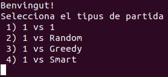
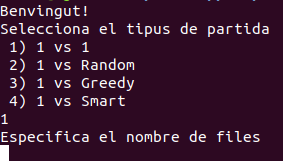
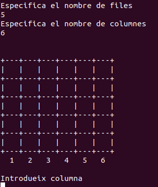

# Quatre en ratlla

Aquí trobem una implementació del quatre en ratlla per a la terminal programat amb Haskell. Es pot jugar 1 contra 1 o contra la pròpia máquina

## Preparacio

A continuació s’explica com s’ha de fer per a poder executar el joc en el teu computador

### Prerequisits

Per a poder compilar el joc és necessari tenir instal·lat el compilador de Haskell, el pots instalar amb les següents comandes en ubuntu:

```bash
sudo apt-get update
sudo apt-get install ghc
```
A més també es necesita una llibreria per a poder utilitzar nombres aleatoris, la pots instal·lar amb les següents comandes en ubuntu:

```bash
> sudo apt install cabal-install
> cabal update
> cabal install random
```
### Instal·lació

Per a poder instal·lar el joc es necessita estar amb la terminal en la mateixa carpeta on es troba l’arxiu anomenat `joc.hs` i executar la següent comanda:

```bash
> ghc joc.hs
```
Una vegada executat ens creara un arxiu anomenat `joc`.

## Execució

Si ja hem creat l’executable del joc només cal utilitzar la següent comanda per a poder-lo executar

```bash
> ./joc
```
Quan l'engeguem ens surten una sèrie de missatges que ens permetran personalitzar la partida al nostre gust.

Primer ens preguntarà el tipus de partida que desitgem



Si elegeixes `1) 1 vs 1` entraras en un mode multijugador classic, llavors cada persona elegeix el seu moviment elegint la columna pertinent.

Per l’altra banda si decideixes qualsevol de les altres tres opcions jugaràs contra la màquina.

* `2) 1 vs Random` : Aquest jugador només elegeix posicions aleatories vàlides
* `3) 1 vs Greedy` : Aquest jugador intenta ajuntar 4 peçes el mes rapid possible i a més, intenta tapar al contrari si està a punt de guanyar
* `4) 1 vs Smart`  : Aquest jugador intenta generar unes jugades en el futur tenint en compte que el contrari també vol aconseguir el 4 en ratlla i a més intenta tapar a l’oponent quat està a put de guanyar.

 A continuació es demana el tamany de les files



I finalment el tamany de les columnes i automaticament comença la partida



## Funcionament

A continuació s’explica un poc el funcionament del joc

### Representacio de les diferents dades

El funcionament del joc es basa en unes estructures de dades anomenades `State` que tenen la seguent forma en el codi:

```haskell
data State = NewState { turn :: Int,
                        row :: Int,
                        col :: Int,
                        board :: Map Int [Int], 
                        player1 :: Player,
                        player2 :: Player}
```

Es poden veure les diferents variables que constitueixen l'estat, una cosa a mencionar és que el tauler anomenat `board` és un dicccionari que donat una clau o valor de columna ens retorna una llista on només hi trobem els elements que existeixen en el tauler, llavors el tamany de la columna `n` es el nombre de fitxes que conté, el `turn` representa el torn de la partida, les variables `row` i `col` indiquen el tamany del tauler que s'ha introduit a l'inici de l'execució i finalment trobem els `Player` que també són una estructura de dades personalitzada:

```haskell
data Player = Player {  pid :: Int, 
                        strat :: Strats}
```
El paràmetre `pid` determina quin es l'identificador del Jugador aquest varia entre 1 i 2 depenent de que comença la partida (predefinit) i el que s'assigna al `board`, el paràmetre `strat` està definida de la seguent forma:

```haskell
data Strats= Human | Rng | Greedy | Smart
    deriving (Eq)
```

Finalment tenim  una petita estructura utilitzada per a controlar les sequències de les diagonals i auesta esta definida per:

```haskell
data Direction= Up | Down 
    deriving (Eq)
```
### Implementació de les estratègies

En aquesta secció s'explica un poc per sobre com s'obtenen les jugades amb les diferents estratègies

#### Random

Primer es crea una llista amb les columnes disponibles on podem tirar una fitxa i s'elegeix una aleatoriament

#### Greedy

La primera jugada és aleatoria a posteriori es busca si el jugador contrari pot guanyar la partida si es troba s'intenta tapar la seva proxima jugada, en cas contrari es busca quina es la proxima cadena més llarga que pot formar i si la troba i llença una fitxa sino s'elegeix una aleatoria

#### Smart

Aquesta funció al principi llença una fitxa aleatoria i a posteriori comprova si el contrincant pot guanyar la partida i l'intenta tapar, si nó intenta generar amb un minimax tenint amb compte que el contrari també vol aconseguir la sequència de llongitud 4 per a guanyar la partida i seleciona una columna com a moviment, en cas de que el resultat no sigui una columna vàlida es passa a crida a l'estretègia greedy.

## Creat amb
* [Haskell] (https://www.haskell.org/) - Llenguantge de programació utilitzat

## Autors

* **Bartomeu Perelló Comas** - *Tot el projecte* - [GitHub](https://github.com/IDarkgenesis)
